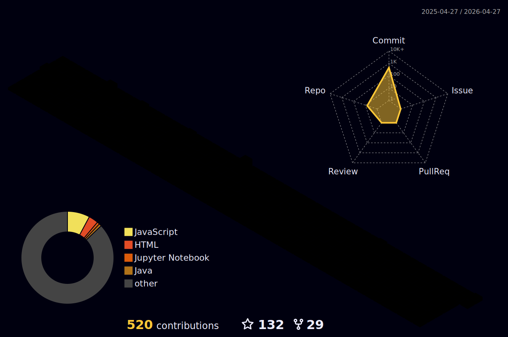

<h1 align="center">
  
  𝐇𝐞𝐥𝐥𝐨, &lt;𝚌𝚘𝚍𝚎𝚛𝚜/&gt;!
  
</h1>

<br/>
<br/>


- 🔭 I’m currently working on **GRANTHAGRA-'Android Application for Students.**
- 🌱 𝙸’𝚖 𝚌𝚞𝚛𝚛𝚎𝚗𝚝𝚕𝚢 𝚕𝚎𝚊𝚛𝚗𝚒𝚗𝚐 **GoLang 𝙿𝚛𝚘𝚐𝚛𝚊𝚖𝚖𝚒𝚗𝚐.**
- 👯 𝙸’𝚖 𝚕𝚘𝚘𝚔𝚒𝚗𝚐 𝚝𝚘 𝚌𝚘𝚕𝚕𝚊𝚋𝚘𝚛𝚊𝚝𝚎 𝚘𝚗 **𝙰𝚗𝚍𝚛𝚘𝚒𝚍, Design or DevOps .**
- 💬 𝙰𝚜𝚔 𝙼𝚎 𝙰𝚋𝚘𝚞𝚝 𝙰𝚗𝚢𝚝𝚑𝚒𝚗𝚐 [here](https://github.com/GovindSingh9447/GovindSingh9447/issues/1) ! 𝙸 𝚊𝚖 𝚑𝚊𝚙𝚙𝚢 𝚝𝚘 𝚑𝚎𝚕𝚙.
- 😄 𝙿𝚛𝚘𝚗𝚘𝚞𝚗𝚜 : **𝙷𝚎/𝙷𝚒𝚖/𝙷𝚒𝚜.**
- ⚡ 𝙵𝚞𝚗 𝚏𝚊𝚌𝚝 : **𝙱𝚎𝚜𝚝 𝙿𝚊𝚛𝚝 𝙾𝚏 𝚃𝚑𝚎 𝙹𝚘𝚞𝚛𝚗𝚎𝚢 𝙸𝚜 : *𝙸𝚝 𝙴𝚗𝚍𝚜.***

<br/>
<br/>


<p align="center">
   •   
  <a href="https://user-badge.committers.top/india_private/GovindSingh9447"></a> •
   •
   •
  <a href="https://github.com/sponsors/GovindSingh9447"></a>
</p>


#


<p align="center">
  
  
  
</p>

#


<a target="_blank"></a>
<br/>

**𝙻𝙰𝙽𝙶𝚄𝙰𝙶𝙴𝚂 𝙰𝙽𝙳 𝚃𝙾𝙾𝙻𝚂:**  
<br/>
<br/>
<code></code>
<code></code>
<code></code>
<code></code>
<code></code>
<code></code>
<code></code>
<code></code>
<code></code>
<code></code>
#
<code></code>
<code></code>
<code></code>
<code></code>
<code></code>
<code></code>
<code></code>
<code></code>
<code></code>
<code></code>

<br/>

#


<details open="">
<summary>
  <g-emoji class="g-emoji" alias="chart_with_upwards_trend" fallback-src="https://github.githubassets.com/images/icons/emoji/unicode/1f4c8.png">📈</g-emoji>
  <strong>𝙶𝚒𝚝𝚑𝚞𝚋 𝚂𝚝𝚊𝚝𝚜 : </strong>
</summary>
<br>

<p align="center">
  <a href="https://github.com/GovindSingh9447">
    
  </a>
  <a href="https://github.com/GovindSingh9447">
    
  </a>
</p>
</details>
<br>





<!-- Don't Run Contribution Graph(Generate Snake) Action on your default Branch-->

<!-- Don't Run Contribution Graph(Generate Snake) Action on your default Branch -->
<br/>


#

<summary>
  <g-emoji class="g-emoji" alias="chart_with_upwards_trend" fallback-src="https://github.githubassets.com/images/icons/emoji/unicode/1f4c8.png">📈</g-emoji>
  <strong>𝚆𝚊𝚔𝚊𝚃𝚒𝚖𝚎 𝚂𝚝𝚊𝚝𝚜 : </strong>
</summary>

<a target="_blank">
  
</a>

<br>
<br>

<!--START_SECTION:waka-->


**🐱 My Github Data** 

> 🏆 290 Contributions in the Year 2022
 > 
> 📦 1.1 MB Used in Github's Storage 
 > 
> 💼 Opted to Hire
 > 
> 📜 34 Public Repositories 
 > 
> 🔑 19 Private Repositories  
 > 
**I'm a Night 🦉** 

```text
🌞 Morning    93 commits     ██░░░░░░░░░░░░░░░░░░░░░░░   9.22% 
🌆 Daytime    274 commits    ██████░░░░░░░░░░░░░░░░░░░   27.16% 
🌃 Evening    396 commits    █████████░░░░░░░░░░░░░░░░   39.25% 
🌙 Night      246 commits    ██████░░░░░░░░░░░░░░░░░░░   24.38%

```


<br> <br>

## 🚀 **Work Experience** :computer_mouse: :desktop_computer: 

| 💼 Designation |  🏢Organization | ⏰Timeline  |
| :-: | :-: | :-: |
| Associate Software Developer | [Decimal Tech](https://www.linkedin.com/company/decimaltech/) | Feb 2022 - Present |
| Open source mentor | [GSsoC](https://gssoc.girlscript.tech/) | Mar 2022 - May 2022 |
| Open source mentor | [SWOC](https://swoc.scriptindia.org/) | Nov 2021 - Feb 2022 |
| Open source mentor | [WoC](https://winterofcode.com/) | Nov 2021 - Feb 2022 |
| Web Developer Intern | [Grivaa Capital](https://www.linkedin.com/company/grivaa-capital/) | Jul 2021 - Sep 2021 |


 Last Updated on 10/03/2022
<!--END_SECTION:waka-->


<h1>
  Connect With Me
  <a target="_blank">
    
  </a>
</h1>

<p align="center">
  <br>
  <a href="https://www.linkedin.com/in/govind-singh9447/" target="_blank">
    <code></code>
  </a>
  
  <a href="https://www.instagram.com/GovindSingh9447/" target="_blank">
    <code></code>
  </a>
    
</p>
<br/>


<br/>
<br/>

<p align="center">
  <a href="https://archiveprogram.github.com/">
    
  </a>
</p>


<div align="center">

### 𝚂𝚑𝚘𝚠 𝚜𝚘𝚖𝚎 ❤️ 𝚋𝚢 𝚜𝚝𝚊𝚛𝚛𝚒𝚗𝚐 𝚜𝚘𝚖𝚎 𝚘𝚏 𝚝𝚑𝚎 𝚛𝚎𝚙𝚘𝚜𝚒𝚝𝚘𝚛𝚒𝚎𝚜!

</div>

#


-----
**Credits**: [GovindSingh9447](https://github.com/GovindSingh9447)

**Last Edited on**: 02/01/2022


